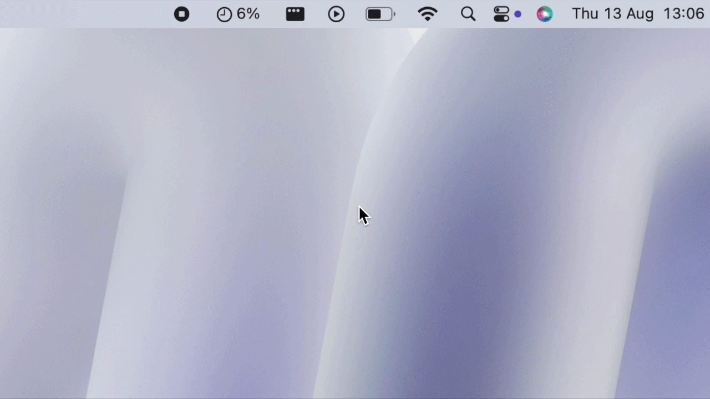

# usagent

A macOS menu bar app that shows Claude subscription usage at a glance.



No dock icon, no settings, no telemetry. Reads the OAuth token Claude
Code already stores in your Keychain and calls Anthropic's usage
endpoint directly.

## Install

Pick one — both end up with `usagent.app` on disk.

### Option A: Download

1. Grab the latest `usagent-X.Y.Z.zip` from
   [Releases](https://github.com/palamim/usagent/releases).
2. Unzip it and move `usagent.app` to `/Applications`.
3. **Right-click `usagent.app` → Open** (don't double-click) the first
   time. macOS will warn it's from an unidentified developer — that's
   because the app is ad-hoc signed, not notarized with a paid Apple
   Developer ID. Click **Open** anyway. This warning only appears once;
   after that it launches normally, including via Login Items.

After the first manual install, `./Scripts/update.sh` (or `make update`)
automates picking up new releases — see [Update](#update) below.

### Option B: Build from source

Requires the Xcode command line tools (Swift 5.9+, macOS 13+).

```sh
git clone https://github.com/palamim/usagent.git
cd usagent
make app     # builds usagent.app with a proper Info.plist (no dock icon)
make open    # builds and opens it
```

A locally built app isn't quarantined by Gatekeeper (that only happens
to files downloaded through a browser), so no right-click-to-open step
is needed here. Move `usagent.app` to `/Applications` if you want it to
live somewhere permanent.

`make run` (plain `swift run`) also works for quick iteration while
developing — it flashes a dock icon briefly on launch since it isn't
run from a bundle, which is expected and harmless.

### Tests

`swift test` runs the `UsageStore` unit tests (state-machine behavior,
binding-clock selection) against a mocked `UsageFetching`, no network
or Keychain access needed. Requires full **Xcode.app**, not just the
Command Line Tools — that's an XCTest requirement on macOS, not
something this project controls. CI (`.github/workflows/tests.yml`)
runs the suite on every push, since GitHub's macOS runners ship with
Xcode preinstalled.

## Run at login

Once `usagent.app` is somewhere permanent (e.g. `/Applications`), add
it to Login Items:

**System Settings → General → Login Items & Extensions → Open at
Login → +** → select `usagent.app`.

If you rebuild from source, `make app` overwrites the same path, so you
won't need to re-add it as a login item afterward.

## Update

```sh
make update    # or ./Scripts/update.sh
```

Downloads the latest GitHub release, quits any running `usagent`,
replaces `/Applications/usagent.app` with the new build, clears the
Gatekeeper quarantine flag so it opens without a right-click, then
reopens it. Prompts to add it to Login Items if it isn't already there.
Requires the `gh` CLI, authenticated (`gh auth login`).

## First launch: Keychain prompt

The OAuth token lives in the macOS Keychain under the service name
`Claude Code-credentials`, created by the Claude Code CLI — not by this
app. The first time usagent reads it, macOS will prompt for your login
password to authorize access. **Click "Always Allow"** (not "Allow") —
otherwise you'll be prompted again on every launch or every refresh.

If you're prompted repeatedly even after that, the Keychain item's ACL
may have been reset (e.g. after rebuilding with a different code
signature). Re-authorizing once with "Always Allow" fixes it again.

## Why direct API calls, not a companion state file

[Claude-Code-Usage-Monitor](https://github.com/Maciek-roboblog/Claude-Code-Usage-Monitor)
invites native menu bar apps to consume its `--write-state` output
instead of calling Anthropic's endpoint directly. We call the endpoint
directly instead: its own "official" data source for that state file is
the same OAuth usage endpoint (behind an opt-in `--api` flag), so
routing through it would mean running a separate Python tool as a
background process for no benefit — just a dependency and a moving
part this app doesn't need.

## Plan support

- **Pro**: what this app is built and tested against. `five_hour` and
  `seven_day` are the two clocks shown; everything else in the response
  is `null` and ignored.
- **Max**: should work unchanged for the two main clocks — same shape,
  higher limits. Max plans are also expected to populate
  `seven_day_opus`, a separate (tighter) weekly sub-cap on Opus, which
  usagent shows as an extra "Weekly Opus" row and folds into the
  "closest to limit" calculation when present. **This is implemented
  defensively but not verified against a real Max account** — if the
  field's shape or meaning turns out to be different, please open an
  issue with a redacted response body.
- **Free**: out of scope. Free-tier accounts don't get Claude Code CLI
  access, so there's no OAuth token for this app to read in the first
  place.
- **Team / Enterprise**: unhandled. These likely use org-pooled limits
  rather than the personal five-hour/weekly windows this app is built
  around — probably a different feature, not a tweak.

## Notes

- The endpoint (`https://api.anthropic.com/api/oauth/usage`) is
  undocumented. It could change or disappear without notice.
- Refreshes on a 60s timer and on click, throttled to at most once per
  15s to avoid hammering the endpoint.
